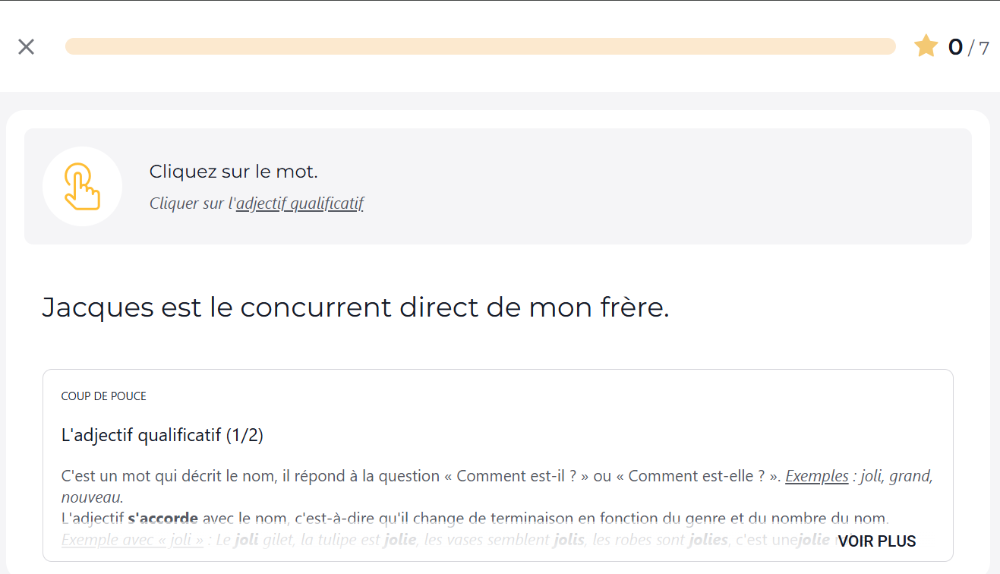

# 🎓 Projet Voltaire Solver

**Automatically solve Projet Voltaire grammar exercises using React Fiber extraction — no AI, no API key.**

[🇫🇷 Version française](README.fr.md)

---

## ✨ Features

| Feature | Description |
|---|---|
| 🔍 **React Fiber Extraction** | Reads answers directly from the app's internal React state — no guessing |
| ✅ **Click-the-mistake exercises** | Detects and clicks the wrong word, or "Il n'y a pas de faute" |
| 📝 **Click-the-word exercises** | Identifies and clicks the correct word (COD, past participle, etc.) |
| 📋 **Drag & Drop exercises** | Automatically places phrases in the correct columns (Tableau) |
| 📊 **Per-session stats** | Correct / wrong / total counter, reset at the start of each new session |
| ⏱️ **Random delay** | Configurable min/max delay between answers to mimic human behaviour |
| 🎲 **Error rate** | Intentionally make mistakes at a configurable rate (0–50%) |
| 🕵️ **Inspector mode** | Click any element on the page to see its selector (debug) |
| 🌗 **Dark / Light mode** | Adapts to your preference |
| 🔔 **Auto update check** | Notified automatically when a new version is available |

---

## 🚀 Installation

1. Download the latest **[Release](https://github.com/quelquun667/Projet-Voltaire-Solver/releases/latest)** (`.zip` file) and extract it.
2. Open Chrome and go to `chrome://extensions/`.
3. Enable **Developer mode** (top-right toggle).
4. Click **Load unpacked**.
5. Select the `ProjetVoltaireExtension` folder (the one containing `manifest.json`).

> **Updating:** Download the new release, replace the folder, then click **Refresh** (↺) on `chrome://extensions/`.

---

## ⚙️ Usage

1. Open the extension popup (Chrome toolbar icon).
2. Toggle **Auto Solve** on.
3. Adjust the min/max delay if needed (default: 1 s – 2 s).
4. Navigate to a Projet Voltaire exercise — the extension takes care of the rest.

---

## 🛠️ How it works

Projet Voltaire is a React Native Web application. The extension injects two scripts:

- **`extractor.js`** runs in the page's MAIN world and traverses the React Fiber tree to extract exercise data (correct answer, type, sentence). It exposes this data via a hidden DOM element.
- **`content.js`** runs in the isolated extension world, reads that data, matches the displayed words to the right exercise, and simulates native pointer events to click the answer.

This approach requires no external API and works regardless of what the page looks like visually.

---

## ⚠️ Disclaimer

This tool is intended for educational and testing purposes only.
